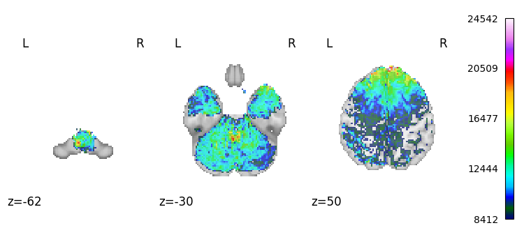

# KAIST 2024 Spring CS471: Graph Machine Learning and Mining
Project Team #14: Dynamic Brain Connectome Learning by 20190169 Junyup Kim & 20220929 Kyaw Ye Thu

Github: https://github.com/KyawYeThu-11/DyGLib

## Introduction
This project aims to learn brain connectome data via an existing dynamic graph learning method, named DyGFormer [[2](#2)]. We've constructed a functional connectivity (FC) matrix with a functional magnetic resonance imaging (fMRI) images, by slightly modifying the approach in [[1](#1)].

We've conducted two downstream tasks, **link prediction** and **graph regression**.  
- The result showed that the DyGFormer model successfully predicted the future links in a dynamic graph, even with a novel connectome dataset.  
- Also, the graph regression task suggested that DyGFormer model can generate a graph embedding that captures the dynamic features of brain connectome data. 

Hence, the novelty of our project are two folds: (1) applying DyGFormer to a novel connectome dataset and (2) extending DyGFormer for graph-level prediction tasks

## Data Generation
We've generated dynamic graphs from raw fMRI images. The raw fMRI images are "100 unrelated subjects" version of HCP Young Adult Dataset [[3](#3)]. We specifically downloaded the language task fMRI dataset, which was measured while a subject is conducting a Language Task [[4](#4)]. However, due to the computational cost, we decided to use data from 50 subjects.  

We've generated a binary adjacency matrix from a functional connectivity (FC) matrix for each subject. 
- The FC matrix was constructed following the sliding-window approach in [1](#1). We set the parameter values (length of window and starting points) to capture connectivity in 50 timepoints. 
- We extracted top 5-percentile values of FC matrix to construct the binary adjacency matrix. 

Since the number of nodes in our brain graph is 400, the preprocessed data has a shape of (`50, 50, 400, 400`) representing (`#subjects, #windows, #nodes, #nodes`) with each adjacency matrix having 8000 edges. Then, we transformed the preprocessed data into into .csv files having the format that DyGFormer necessitates, which is described in `DATASETS_README.md` under `DG_data` folder.

## Link prediction task
The goal of this task is to predict the **possibility of connectivity** (output) between the given **brain nodes (Regions of Interest, RoIs)** (inputs). The training procedure is as follows.

1. Source node IDs and destination node IDs of a particular batch are fed into DyGFormer to output source node embeddings and destination node embeddings
2. The two types of node embeddings are added pair-wise to obtain the unified node embeddings of the batch.
3. Node embeddings of the batch are fed into a simple MLP network to output the possibility.
4. As negative sampling, we repeat 1, 2 and 3 but with incorrect destination node IDs.
5. The possibility should be close to one when matched IDs are used but zero otherwise, and the loss is calculated by Binary Cross Entropy.
6. We repeat these steps for all batches.

## Graph Regression Task
The goal of this task is to predict the **language task score** (output) of a subject given the **connections between brain nodes across time** (input). The training procedure is as follows.

1. Source node IDs and destination node IDs of a particular batch are fed into DyGFormer to output source node embeddings and destination node embeddings
2. The two types of node embeddings are averaged to obtain the unified node embeddings of the batch.
2. All node embeddings of the batch undergo mean pooling to obtain the graph embedding of the batch.
3. Graph embeddings vectors for all batches are fed into a simple CNN model followed by MLP layers to produce a single value of language accuracy score, and the loss is calculated by Mean Squared Error.
4. We repeat these steps for all subjects.

## Explanation of Directory Structure
### Directories
- `DG_data` - contains the raw dataset in the format of .csv files.  
- `models` - contains the models in the format of .py files.  
- `preprocess_data` - contains the code for preprocessing the raw dataset in DG_data folder.  
- `processed_data` - contains the preprocessed dataset, which can be directly fed into the graph regression model.
- `saved_models` - contains the saved models for each run. The numbers represent the index of repeated runs.  
- `utils` - This folder contains the code used for utility in our model and training. Originally from [[2](#2)].  

### Notebook files
- `Dataset.ipynb` - generates a brain connectome dataset with files downloaded from [[3](#3)].  
- `train_graph_regression.ipynb` - trains a DyGFormer model for the graph regression task with the dataset generated by Dataset.ipynb.  
- `train_link_prediction.ipynb` - trains a DyGFormer model for the link predictiont task with the same dataset.  

## Notes
- You can directly see our results by running the cells under `Testing` sections of the two training notebooks with the checkpoints from `saved_models` folder after running necessary cells. 
- Our code can be run either using CPU or GPU although we trained our models with GPU. 
    - We ensured that the session doesn't crash due to memory overflow, but if it happens, please restart the session and train again.
    - If you train the models, note that `load_checkpoint` parameter is `False` by default. 

- We chose not to include the raw fMRI image files (in the format of `.nii.gz`) in the submission since there are 50 raw images each with the size of around 250MB. It would take a lot of time to unzip the files and upload it on Google Colab environment. Hence, to generate data by yourself using `Dataset.ipynb`, please add a shortcut to our folder, [CS471 Project](https://drive.google.com/drive/folders/1VMn57KmlJ20DlviBlGufDC7vgdWIR9ni?usp=sharing), to your own drive first. The details are described in the notebook.  

- If you have any further inquiries about preprocessing fMRI images, please contact Junyup Kim (ytrewq271828@kaist.ac.kr) or Kyaw Ye Thu (kyawyethu@kaist.ac.kr).  

## References
[<a name="1">1</a>] Learning dynamic graph representation of brain connectome with spatio-temporal attention, Kim et al., NeurIPS 2021.   
https://doi.org/10.48550/arXiv.2105.13495  

[<a name="2">2</a>] Towards better dynamic graph learning: new architecture and unified library  
Yu et al., NeurIPS 2023.  
https://doi.org/10.48550/arXiv.2303.13047  

[<a name="3">3</a>] HCP Young Adult Dataset  
https://www.humanconnectome.org/study/hcp-young-adult  

[<a name="4">4</a>] Mapping Anterior Temporal Lobe Language Areas with FMRI: A Multi-Center Normative Study  
https://doi.org/10.1016/j.neuroimage.2010.09.048  

